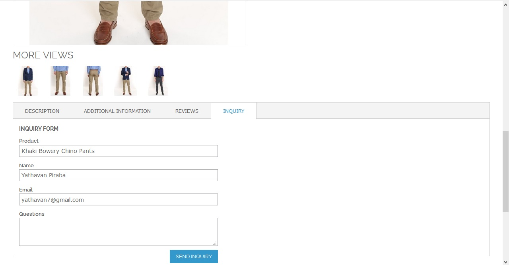
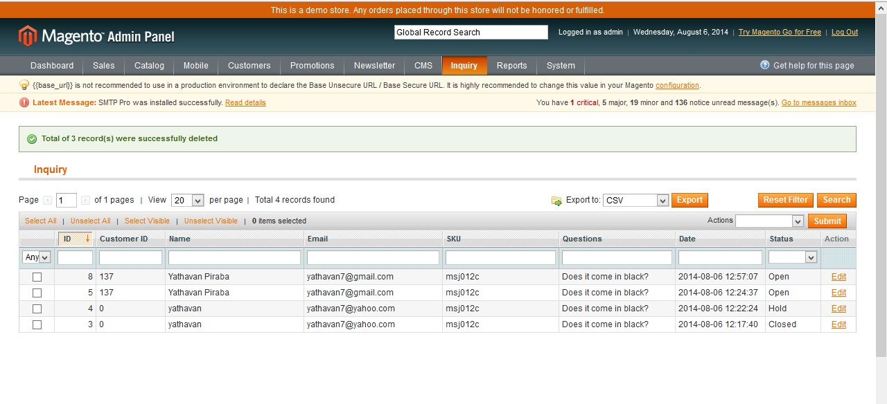

eTw Product Inquiry
===========

Magento Product Inquiry Extension

As online stores are virtual mostly customers will end up with many questions about products. This extension enables customers to send inquiries about products. And store admin will get notified instantly via email. It will help customers to get their doubts cleared quickly and help store admin to increase sales.

<h2>*Features*</h2>
<ul>
<li>Simple inquiry form on product page</li>
<li>Auto identify logged in customers and load their email</li>
<li>Notify store admin via email instantly</li>
<li>Save and display inquiries in admin panel for future reference</li>
</ul>

<h2>How it works?</h2>

Once you installed the extension, customers can see a simple inquiry form attached on product page. Once customer submitted an inquiry, store admin will get notified via email and inquiry will be listed in admin panel.

Front End

Admin Panel

<h2>Installation and Update</h2>

The extension can be installed via magento connect or manually downloading the source.

This extension come with an email template and an inquiry form. Both are in English(US). You can update email template and form styles.

If you willing to modify form fields, don't forget to update controllers, model and also database.

<h2>Note</h2>

This inquiry form does not have any configurations. Further enhancements will be added in feature versions.
